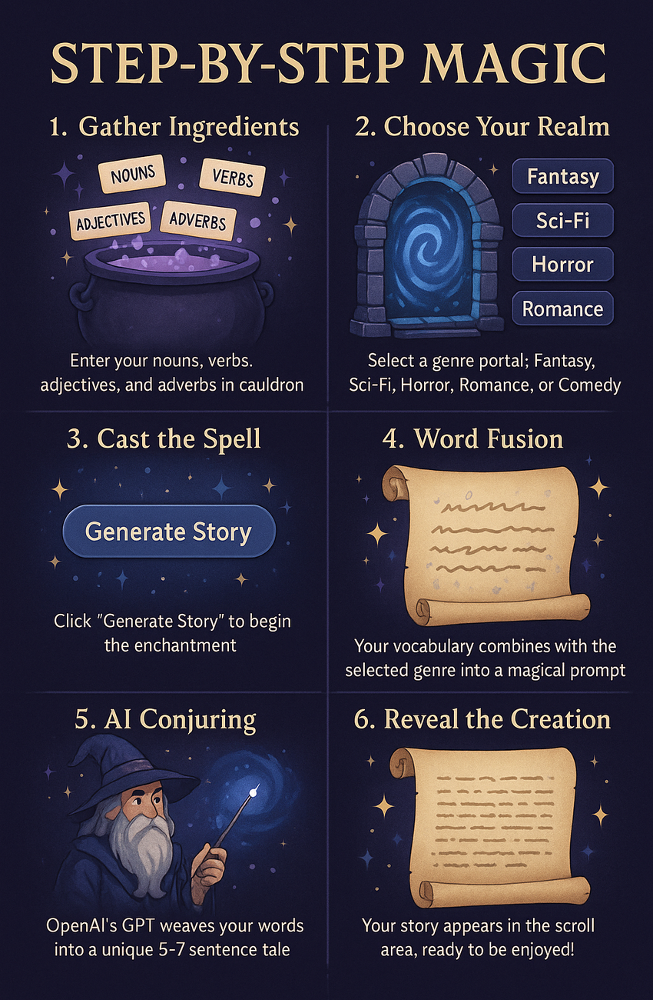

# ✨🧙‍♂️ WordAlchemy: Turn Words into Enchanted Stories! 🪄📚


> *"In the mystical halls of WordAlchemy, mere words are transmuted into wondrous tales by the power of AI sorcery."*

---

## 🧪 What is WordAlchemy?

**WordAlchemy** is a magical desktop application that lets you conjure creative stories from your own vocabulary ingredients. Enter your nouns, verbs, adjectives, and adverbs, select a genre, and with a tap of the "Generate Story" button, watch as the OpenAI GPT wizard weaves your words into a spellbinding 5-7 sentence tale.

Whether you're a student, teacher, or writer seeking inspiration, WordAlchemy is your enchanted cauldron for storycraft!

---

## 🧙‍♀️ How Does the Alchemy Work?




---

## 🏺 Features

- **Alchemy-Themed GUI:** Mystical Tkinter interface with fields for nouns, verbs, adjectives, and adverbs.
- **Genre Spellbook:** Choose your story's flavor—Sci-Fi, Fantasy, Comedy, Horror, or Romance.
- **AI Story Wizardry:** OpenAI GPT transforms your vocabulary into a unique, imaginative story.
- **Instant Results:** See your story materialize in a scroll-like text box.
- **Executable Elixir:** Easily create a standalone app with PyInstaller.
- **For Learners & Creators:** Perfect for vocabulary practice, creative writing, and classroom enchantments.

---

## 🧰 Installation & Setup

1. **Clone the Grimoire:**
   ```sh
   git clone https://github.com/Eraiyanbupeterfrancis/WordAlchemy.git
   cd WordAlchemy
   ```

2. **Summon Dependencies:**
   ```sh
   pip install -r requirement.txt
   ```

3. **Run the Alchemist's Lab:**
   ```sh
   python WordAlchemy.py
   ```

4. **(Optional) Brew an Executable:**
   ```sh
   pyinstaller --onefile --windowed --icon=logo.ico WordAlchemy.py
   ```
   The enchanted `.exe` will appear in the `dist/` cauldron.

----

## 🪄 Usage: Cast Your First Story Spell

1. **Enter your magical ingredients:**  
   - Nouns, verbs, adjectives, and adverbs (comma-separated)
2. **Select a genre from the spellbook.**
3. **Click "Generate Story"** and watch your words transform!

### 📝 Example

**Inputs:**
- Nouns: dragon, castle
- Verbs: fly, guard
- Adjectives: ancient, golden
- Adverbs: bravely, silently
- Genre: Fantasy

**Enchanted Output:**
> In the ancient castle atop the misty hill, a golden dragon bravely guarded its treasure. Each night, it would silently fly across the moonlit sky, watching for intruders. The villagers whispered tales of its shimmering scales and wise eyes. One daring soul ventured close, hoping for a glimpse of magic. But the dragon, ever vigilant, ensured the castle remained a place of wonder and mystery.

---

## 🎓 Who Can Use This Spellbook?

- **Students:** Practice vocabulary in a fun, interactive way.
- **Teachers:** Enchant your classroom with creative writing prompts.
- **Writers:** Break through writer’s block with AI-powered inspiration.
- **Anyone:** Who loves the magic of words!

---

## 🔮 Roadmap: Future Enchantments

- [ ] Save & export your stories as scrolls (text/PDF)
- [ ] Customizable story length and tone
- [ ] More genres and magical themes
- [ ] Word frequency and usage highlights
- [ ] Share stories with fellow alchemists online
- [ ] Dark mode for late-night spellcasting

---

## ✉️ Contributing & Feedback

Have a magical idea or found a gremlin in the code?  
Open an issue or send a pull request—your alchemy is welcome!

---

> _"Let your words become wonders. Happy Alchemizing!"_
